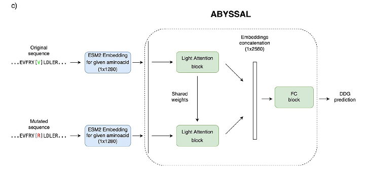

# abyssal-pytorch (wip)



Implementation of [Abyssal](https://www.biorxiv.org/content/10.1101/2022.12.31.522396v1.full), a deep neural network trained with a new "mega" dataset to predict the impact of an amino acid variant on protein stability.

## Installation

```shell
pip install abyssal-pytorch
```

## Usage
```python
import torch
from abyssal_pytorch import Abyssal

model = Abyssal()

wt_emb = torch.randn(1, 1280)    # ESM2 embedding for the wildtype amino acid.
mut_emb = torch.randn(1, 1280)   # ESM2 embedding for the mutated amino acid.

out = model(wt_emb, mut_emb)  # (1, 1) predicted ddG.
```

### Training from scratch
Please refer to `note/data-preprocessing.ipynb` notebook for data preprocessing. Running this notebook will generate `mega.train.csv`, `mega.val.csv` and `mega.test.csv` containing metadata for model training and evaluation.

For faster training, extract ESM2 embeddings and save them to the disk.
```shell
$ python prefetch_embeddings.py -i data/mega.train.csv -o data/embeddings
$ python prefetch_embeddings.py -i data/mega.val.csv -o data/embeddings
$ python prefetch_embeddings.py -i data/mega.test.csv -o data/embeddings
```

This will save embedding vectors in `.pt` format in `data/embeddings` directory.

You can now train model.

```shell
$ python train.py
```

## Citations

```bibtex
@article {Pak2022.12.31.522396,
	author = {Pak, Marina A and Dovidchenko, Nikita V and Sharma, Satyarth Mishra and Ivankov, Dmitry N},
	title = {New mega dataset combined with deep neural network makes a progress in predicting impact of mutation on protein stability},
	elocation-id = {2022.12.31.522396},
	year = {2023},
	doi = {10.1101/2022.12.31.522396},
	publisher = {Cold Spring Harbor Laboratory},
	URL = {https://www.biorxiv.org/content/early/2023/01/02/2022.12.31.522396},
	eprint = {https://www.biorxiv.org/content/early/2023/01/02/2022.12.31.522396.full.pdf},
	journal = {bioRxiv}
}

```
